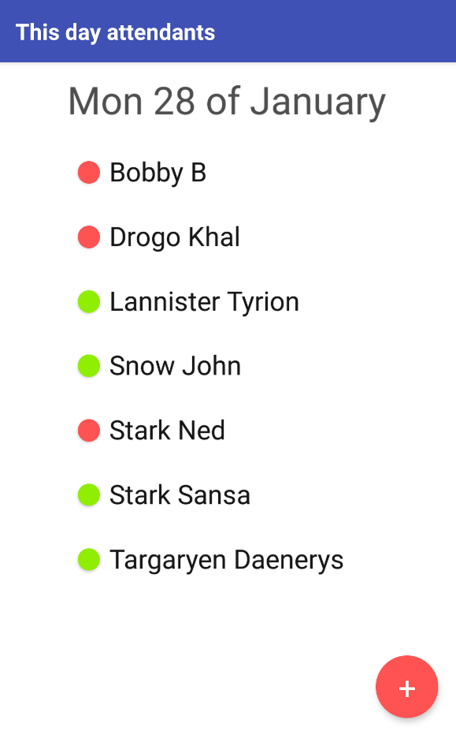
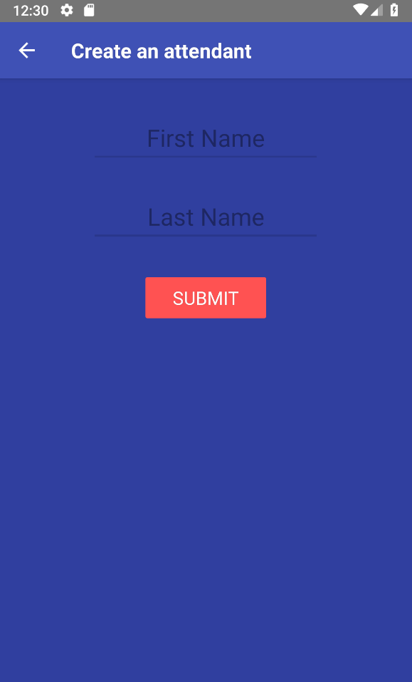
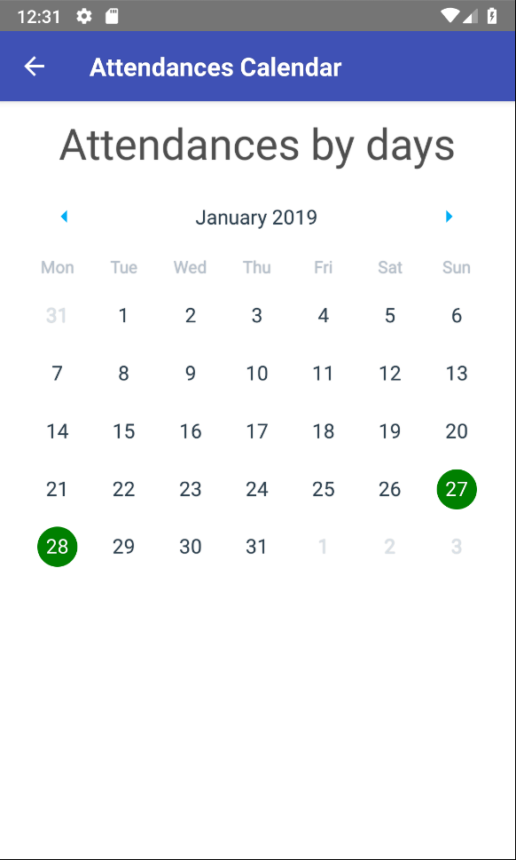
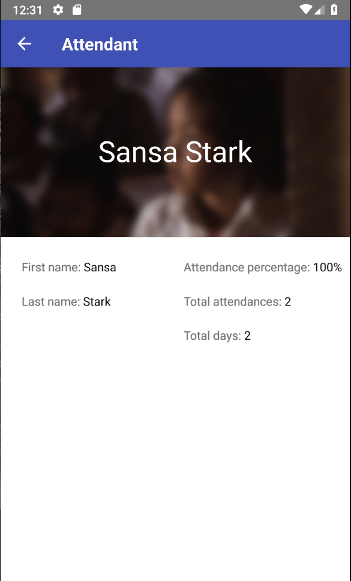

# AttendanceApp

Attendance Mobile Application built in Clojure



[](https://travis-ci.org/ne1ro/attendance-app)

## Usage

```
re-natal use-figwheel && react-native run-android
```

## Development

```
lein repl
(start-figwheel! "android")
```

Debug app's db:

```
cljs.user=> re-frame.db/app-db
```

## REPL

```
(in-ns 'attendance-app.android.core)
```

## More images





## License

Copyright © 2019 neiro

This program and the accompanying materials are made available under the
terms of the Eclipse Public License 2.0 which is available at
http://www.eclipse.org/legal/epl-2.0.

This Source Code may also be made available under the following Secondary
Licenses when the conditions for such availability set forth in the Eclipse
Public License, v. 2.0 are satisfied: GNU General Public License as published by
the Free Software Foundation, either version 2 of the License, or (at your
option) any later version, with the GNU Classpath Exception which is available
at https://www.gnu.org/software/classpath/license.html.
